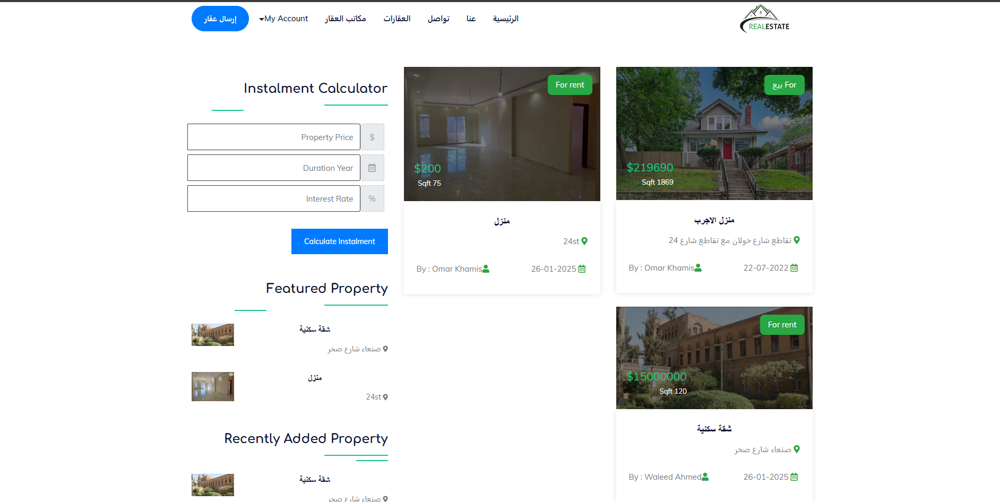
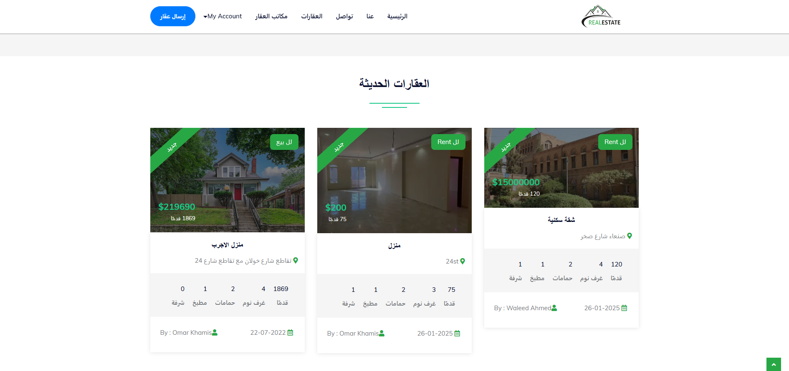
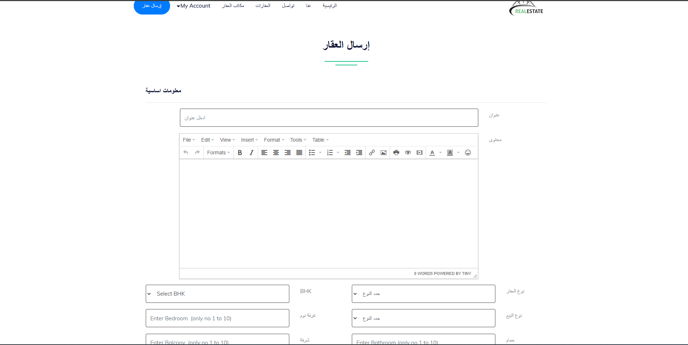
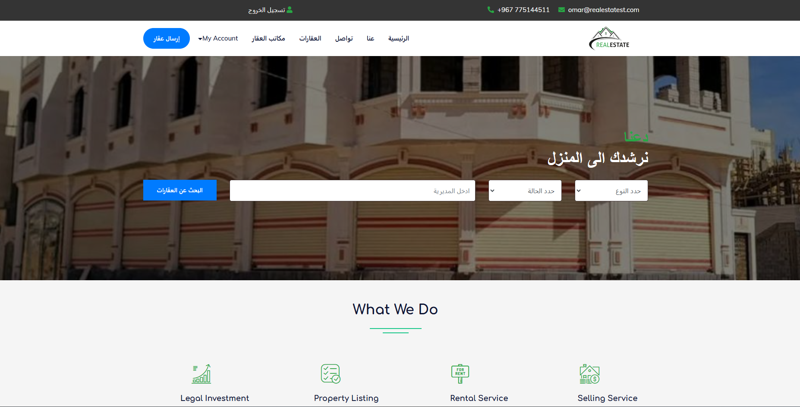

# 🏠 PropZone


**PropZone** is a lightweight and efficient real estate web application built using PHP and MySQL. It provides an intuitive admin dashboard to manage property listings, and a clean front-end interface for users to browse properties.

---

## 📌 Features

- 🏡 Add, edit, and delete property listings  
- 🖼️ Upload images for each property  
- 🔒 Admin dashboard with secure login  
- 🌐 Front-facing interface for visitors  
- 📱 Responsive layout with Bootstrap  

---

## 🛠️ Technologies Used

- PHP (Core)
- MySQL
- HTML & CSS
- Bootstrap
- JavaScript

---

## 🚀 How to Run

1. **Clone the repository**

   ```bash
   git clone https://github.com/omarkhamis088/PropZone.git
   ```

2. **Move the project to your web server directory.**

   For example, if using XAMPP:
   `C:\xampp\htdocs\PropZone`

3. **Import the database.**
Open phpMyAdmin
Create a new database (e.g., propzone)
Import the SQL file from the DATABASE FILE folder

4. **Run the project in your browser.**
   `http://localhost/PropZone`
   
---

## 🔐 Default Admin Login

- **Username:** `admin`  
- **Password:** `123`

---


## 📸 Screenshots

### 🏠 View Properties Page  


### 🏘️ Real Estate Home Page  


### ➕ Add Property Page  


### ℹ️ About Page  


---

## 🧭 Planned Improvements

- 🔎 Search and filtering by location, type, and price  
- 📱 Full mobile responsiveness  
- 🛡️ Enhanced security (prepared statements, input validation)  
- 👤 User registration and authentication  
- 🗺️ Google Maps integration (optional)

---

## 👨‍💻 Author

**Omar Khamis**  
GitHub: [@omarkhamis088](https://github.com/omarkhamis088)

---

## 📄 License

This project is licensed under the [MIT License](https://opensource.org/licenses/MIT).
